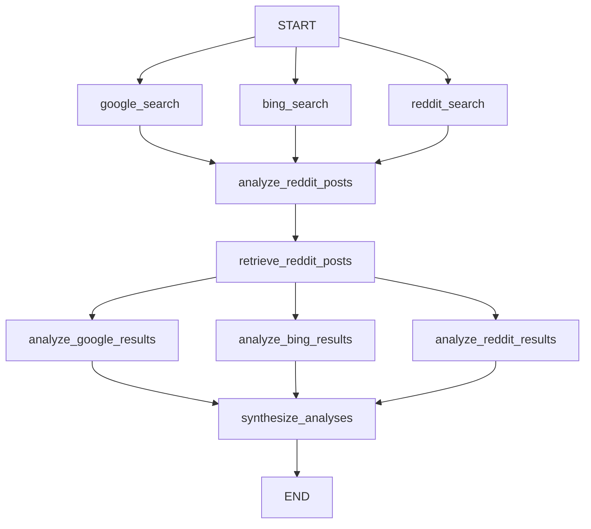

## What LangGraph is

[LangGraph](https://langchain-ai.github.io/langgraph/) is a library for building stateful, multi-step workflows as directed graphs. You define nodes (Python functions) and edges (dependencies between them), compile the graph, then invoke it with an initial state dict. LangGraph handles:

- **Parallel execution** — nodes with no unresolved upstream dependencies run concurrently
- **Convergence** — nodes with multiple incoming edges wait until every upstream node has completed
- **Typed state** — a shared `TypedDict` is passed through the graph; each node returns a partial update

The Deep Research Agent uses LangGraph because its pipeline has two natural parallel fans with convergence points between them, and because deterministic node-based execution makes the workflow easy to test, retry, and extend.

## Graph construction

The full `StateGraph` build from `main.py`:

```python main.py
graph_builder = StateGraph(State)

# Register nodes
graph_builder.add_node("google_search", google_search)
graph_builder.add_node("bing_search", bing_search)
graph_builder.add_node("reddit_search", reddit_search)
graph_builder.add_node("analyze_reddit_posts", analyze_reddit_posts)
graph_builder.add_node("retrieve_reddit_posts", retrieve_reddit_posts)
graph_builder.add_node("analyze_google_results", analyze_google_results)
graph_builder.add_node("analyze_bing_results", analyze_bing_results)
graph_builder.add_node("analyze_reddit_results", analyze_reddit_results)
graph_builder.add_node("synthesize_analyses", synthesize_analyses)

# Fan 1: START → three parallel search nodes
graph_builder.add_edge(START, "google_search")
graph_builder.add_edge(START, "bing_search")
graph_builder.add_edge(START, "reddit_search")

# Convergence 1: all three search nodes → URL selection → post retrieval
graph_builder.add_edge("google_search", "analyze_reddit_posts")
graph_builder.add_edge("bing_search", "analyze_reddit_posts")
graph_builder.add_edge("reddit_search", "analyze_reddit_posts")
graph_builder.add_edge("analyze_reddit_posts", "retrieve_reddit_posts")

# Fan 2: post retrieval → three parallel analysis nodes
graph_builder.add_edge("retrieve_reddit_posts", "analyze_google_results")
graph_builder.add_edge("retrieve_reddit_posts", "analyze_bing_results")
graph_builder.add_edge("retrieve_reddit_posts", "analyze_reddit_results")

# Convergence 2: all three analysis nodes → synthesis → END
graph_builder.add_edge("analyze_google_results", "synthesize_analyses")
graph_builder.add_edge("analyze_bing_results", "synthesize_analyses")
graph_builder.add_edge("analyze_reddit_results", "synthesize_analyses")
graph_builder.add_edge("synthesize_analyses", END)

graph = graph_builder.compile()
```

## Workflow diagram



## Node reference

### `google_search`

Calls `serp_search(query, engine="google")` from `web_operations.py`. This makes a POST request to the Bright Data SERP API targeting `https://www.google.com/search` with `brd_json=1` for structured JSON output. Returns `{"google_results": ...}` containing `knowledge` and `organic` result arrays.

```python main.py
def google_search(state: State):
    user_question = state.get("user_question", "")
    google_results = serp_search(user_question, engine="google")
    return {"google_results": google_results}
```

### `bing_search`

Identical in structure to `google_search` but calls `serp_search(query, engine="bing")`, targeting `https://www.bing.com/search`. Returns `{"bing_results": ...}`. Runs in parallel with `google_search` and `reddit_search`.

```python main.py
def bing_search(state: State):
    user_question = state.get("user_question", "")
    bing_results = serp_search(user_question, engine="bing")
    return {"bing_results": bing_results}
```

### `reddit_search`

Calls `reddit_search_api(keyword=user_question)` which triggers a Bright Data dataset snapshot (dataset ID `gd_lvz8ah06191smkebj4`), polls for completion, downloads the result, and returns a parsed list of `{title, url}` dicts. Returns `{"reddit_results": {"parsed_posts": [...], "total_found": N}}`.

```python main.py
def reddit_search(state: State):
    user_question = state.get("user_question", "")
    reddit_results = reddit_search_api(keyword=user_question)
    return {"reddit_results": reddit_results}
```

<Note>
  `reddit_search` uses the snapshot pattern (trigger → poll → download) rather than a direct request. This means it may take longer than the SERP nodes, but LangGraph's parallel execution prevents that from blocking Google and Bing.
</Note>

### `analyze_reddit_posts`

The first convergence node. Receives the completed `reddit_results` and uses a **structured LLM call** to select the most relevant Reddit thread URLs. The LLM output is validated against the `RedditURLAnalysis` Pydantic model via `llm.with_structured_output(RedditURLAnalysis)`. Returns `{"selected_reddit_urls": ["https://...", ...]}`. If `reddit_results` is empty, returns an empty list without invoking the LLM.

```python main.py
def analyze_reddit_posts(state: State):
    structured_llm = llm.with_structured_output(RedditURLAnalysis)
    messages = get_reddit_url_analysis_messages(user_question, reddit_results)
    analysis = structured_llm.invoke(messages)
    return {"selected_reddit_urls": analysis.selected_urls}
```

### `retrieve_reddit_posts`

Calls `reddit_post_retrieval(selected_urls)` from `web_operations.py`, which triggers a second Bright Data snapshot (dataset ID `gd_lvzdpsdlw09j6t702`) to fetch full post content and comments for each selected URL. Returns `{"reddit_post_data": {"comments": [...], "total_retrieved": N}}`.

### `analyze_google_results`

Invokes GPT-4o with the Google-specific analysis prompt from `prompts.py`. The prompt instructs the model to focus on authoritative sources, official documentation, and verified statistics. Returns `{"google_analysis": "..."}` (a plain text analysis string).

```python main.py
def analyze_google_results(state: State):
    messages = get_google_analysis_messages(user_question, google_results)
    reply = llm.invoke(messages)
    return {"google_analysis": reply.content}
```

### `analyze_bing_results`

Identical in structure to `analyze_google_results` but uses the Bing-specific prompt, which focuses on complementary perspectives, technical documentation, and recent news articles. Returns `{"bing_analysis": "..."}`. Runs in parallel with `analyze_google_results` and `analyze_reddit_results`.

### `analyze_reddit_results`

Invokes GPT-4o with the Reddit analysis prompt, which instructs the model to extract real user experiences, community consensus, and direct quotes from posts and comments. Receives both `reddit_results` (the search summary) and `reddit_post_data` (full post + comment content). Returns `{"reddit_analysis": "..."}`.

```python main.py
def analyze_reddit_results(state: State):
    messages = get_reddit_analysis_messages(
        user_question, reddit_results, reddit_post_data
    )
    reply = llm.invoke(messages)
    return {"reddit_analysis": reply.content}
```

### `synthesize_analyses`

The final convergence node. Receives all three analysis strings and invokes GPT-4o with the synthesis prompt, which instructs the model to identify common themes, resolve conflicts, cite sources by name (Google, Bing, Reddit), and structure the output clearly. Writes the final answer to both `final_answer` and the `messages` list.

```python main.py
def synthesize_analyses(state: State):
    messages = get_synthesis_messages(
        user_question, google_analysis, bing_analysis, reddit_analysis
    )
    reply = llm.invoke(messages)
    final_answer = reply.content
    return {
        "final_answer": final_answer,
        "messages": [{"role": "assistant", "content": final_answer}],
    }
```

## Edge structure and convergence

The graph has two fan-out/fan-in pairs:

| Phase | Fan out from | Parallel nodes | Converge at |
|---|---|---|---|
| Search | `START` | `google_search`, `bing_search`, `reddit_search` | `analyze_reddit_posts` |
| Analysis | `retrieve_reddit_posts` | `analyze_google_results`, `analyze_bing_results`, `analyze_reddit_results` | `synthesize_analyses` |

LangGraph implements convergence by tracking the **in-degree** of each node. A node with multiple incoming edges is only scheduled after every one of its upstream nodes has successfully returned. You do not need to write any synchronization code — the edge declarations in `add_edge` are sufficient.

<Tip>
  If you add a new source (for example, a Hacker News search node), you wire it the same way: add edges from `START` to your new node, from your new node to `analyze_reddit_posts`, from `retrieve_reddit_posts` to your new analysis node, and from your new analysis node to `synthesize_analyses`. LangGraph handles the rest.
</Tip>

## Next steps

<CardGroup cols={2}>
  <Card title="State management" icon="database" href="/architecture/state-management">
    See how the typed State TypedDict carries data between nodes
  </Card>
  <Card title="Architecture overview" icon="sitemap" href="/architecture/overview">
    Revisit the high-level pipeline design
  </Card>
</CardGroup>
