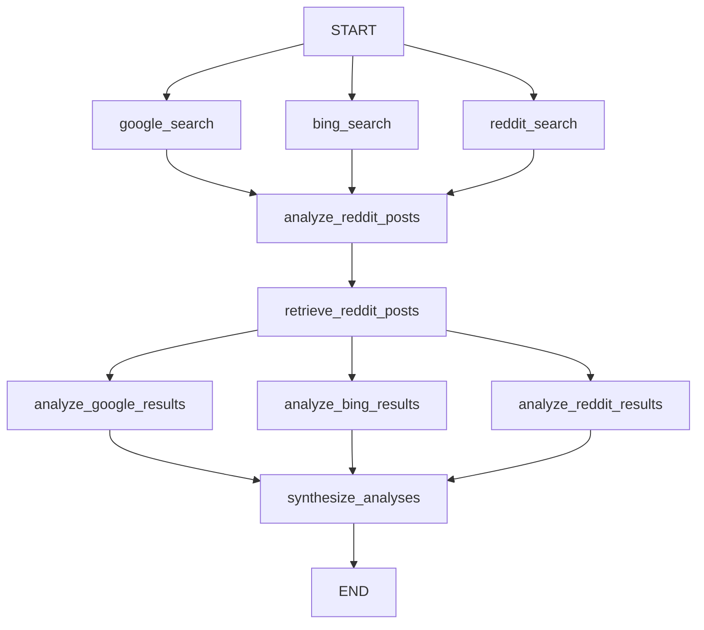

Each function below is registered as a named node in the `StateGraph`. The graph runs `google_search`, `bing_search`, and `reddit_search` in parallel from `START`, then fans in through URL analysis, retrieval, per-source analysis, and final synthesis.



---

## `google_search`

```python
def google_search(state: State):
```

Queries Google via `serp_search` and stores the structured results in state.

**Reads from state:** `user_question`

**Returns:**

| Key | Type | Description |
|-----|------|-------------|
| `google_results` | `dict \| None` | `{"knowledge": dict, "organic": list}` from the Bright Data SERP response |

```python
def google_search(state: State):
    user_question = state.get("user_question", "")
    print(f"Searching Google for: {user_question}")

    google_results = serp_search(user_question, engine="google")

    return {"google_results": google_results}
```

---

## `bing_search`

```python
def bing_search(state: State):
```

Queries Bing via `serp_search` and stores the structured results in state.

**Reads from state:** `user_question`

**Returns:**

| Key | Type | Description |
|-----|------|-------------|
| `bing_results` | `dict \| None` | `{"knowledge": dict, "organic": list}` from the Bright Data SERP response |

```python
def bing_search(state: State):
    user_question = state.get("user_question", "")
    print(f"Searching Bing for: {user_question}")

    bing_results = serp_search(user_question, engine="bing")

    return {"bing_results": bing_results}
```

---

## `reddit_search`

```python
def reddit_search(state: State):
```

Searches Reddit for posts matching the user question via `reddit_search_api`.

**Reads from state:** `user_question`

**Returns:**

| Key | Type | Description |
|-----|------|-------------|
| `reddit_results` | `dict \| None` | `{"parsed_posts": [{"title": str, "url": str}], "total_found": int}` |

```python
def reddit_search(state: State):
    user_question = state.get("user_question", "")
    print(f"Searching Reddit for: {user_question}")

    reddit_results = reddit_search_api(keyword=user_question)
    print(reddit_results)

    return {"reddit_results": reddit_results}
```

---

## `analyze_reddit_posts`

```python
def analyze_reddit_posts(state: State):
```

Uses a structured LLM call (GPT-4o with `RedditURLAnalysis` output schema) to identify which Reddit post URLs are most worth retrieving in full.

**Reads from state:** `user_question`, `reddit_results`

**Returns:**

| Key | Type | Description |
|-----|------|-------------|
| `selected_reddit_urls` | `list[str]` | Reddit post URLs selected as high-value by the LLM |

<Note>
If `reddit_results` is empty or falsy, the node returns `{"selected_reddit_urls": []}` immediately without calling the LLM. Any exception during structured output parsing also yields an empty list.
</Note>

```python
def analyze_reddit_posts(state: State):
    user_question = state.get("user_question", "")
    reddit_results = state.get("reddit_results", "")

    if not reddit_results:
        return {"selected_reddit_urls": []}

    structured_llm = llm.with_structured_output(RedditURLAnalysis)
    messages = get_reddit_url_analysis_messages(user_question, reddit_results)

    try:
        analysis = structured_llm.invoke(messages)
        selected_urls = analysis.selected_urls

        print("Selected URLs:")
        for i, url in enumerate(selected_urls, 1):
            print(f"   {i}. {url}")

    except Exception as e:
        print(e)
        selected_urls = []

    return {"selected_reddit_urls": selected_urls}
```

---

## `retrieve_reddit_posts`

```python
def retrieve_reddit_posts(state: State):
```

Fetches full comment data for the URLs selected by `analyze_reddit_posts` using `reddit_post_retrieval`.

**Reads from state:** `selected_reddit_urls`

**Returns:**

| Key | Type | Description |
|-----|------|-------------|
| `reddit_post_data` | `dict \| list` | `{"comments": [{"comment_id", "content", "date"}], "total_retrieved": int}` on success, or `[]` on failure/empty URLs |

<Note>
If `selected_reddit_urls` is empty, the node returns `{"reddit_post_data": []}` without making an API call.
</Note>

```python
def retrieve_reddit_posts(state: State):
    print("Getting reddit post comments")

    selected_urls = state.get("selected_reddit_urls", [])

    if not selected_urls:
        return {"reddit_post_data": []}

    print(f"Processing {len(selected_urls)} Reddit URLs")

    reddit_post_data = reddit_post_retrieval(selected_urls)

    if reddit_post_data:
        print(f"Successfully got {len(reddit_post_data)} posts")
    else:
        print("Failed to get post data")
        reddit_post_data = []

    print(reddit_post_data)
    return {"reddit_post_data": reddit_post_data}
```

---

## `analyze_google_results`

```python
def analyze_google_results(state: State):
```

Sends Google results to the LLM for factual extraction and source-level summarization.

**Reads from state:** `user_question`, `google_results`

**Returns:**

| Key | Type | Description |
|-----|------|-------------|
| `google_analysis` | `str` | LLM-generated analysis of Google SERP results |

```python
def analyze_google_results(state: State):
    print("Analyzing google search results")

    user_question = state.get("user_question", "")
    google_results = state.get("google_results", "")

    messages = get_google_analysis_messages(user_question, google_results)
    reply = llm.invoke(messages)

    return {"google_analysis": reply.content}
```

---

## `analyze_bing_results`

```python
def analyze_bing_results(state: State):
```

Sends Bing results to the LLM to extract complementary insights not typically covered by Google.

**Reads from state:** `user_question`, `bing_results`

**Returns:**

| Key | Type | Description |
|-----|------|-------------|
| `bing_analysis` | `str` | LLM-generated analysis of Bing SERP results |

```python
def analyze_bing_results(state: State):
    print("Analyzing bing search results")

    user_question = state.get("user_question", "")
    bing_results = state.get("bing_results", "")

    messages = get_bing_analysis_messages(user_question, bing_results)
    reply = llm.invoke(messages)

    return {"bing_analysis": reply.content}
```

---

## `analyze_reddit_results`

```python
def analyze_reddit_results(state: State):
```

Sends both the Reddit search result metadata and the full retrieved post/comment data to the LLM for community-insight extraction.

**Reads from state:** `user_question`, `reddit_results`, `reddit_post_data`

**Returns:**

| Key | Type | Description |
|-----|------|-------------|
| `reddit_analysis` | `str` | LLM-generated community analysis with direct quotes from posts and comments |

```python
def analyze_reddit_results(state: State):
    print("Analyzing reddit search results")

    user_question = state.get("user_question", "")
    reddit_results = state.get("reddit_results", "")
    reddit_post_data = state.get("reddit_post_data", "")

    messages = get_reddit_analysis_messages(user_question, reddit_results, reddit_post_data)
    reply = llm.invoke(messages)

    return {"reddit_analysis": reply.content}
```

---

## `synthesize_analyses`

```python
def synthesize_analyses(state: State):
```

Merges the three per-source analyses into a single, structured answer with citations. This is the terminal computation node — its output becomes the final response.

**Reads from state:** `user_question`, `google_analysis`, `bing_analysis`, `reddit_analysis`

**Returns:**

| Key | Type | Description |
|-----|------|-------------|
| `final_answer` | `str` | Comprehensive synthesized answer with cross-source citations |
| `messages` | `list` | Appends `{"role": "assistant", "content": final_answer}` to the message history |

```python
def synthesize_analyses(state: State):
    print("Combine all results together")

    user_question = state.get("user_question", "")
    google_analysis = state.get("google_analysis", "")
    bing_analysis = state.get("bing_analysis", "")
    reddit_analysis = state.get("reddit_analysis", "")

    messages = get_synthesis_messages(
        user_question, google_analysis, bing_analysis, reddit_analysis
    )

    reply = llm.invoke(messages)
    final_answer = reply.content

    return {"final_answer": final_answer, "messages": [{"role": "assistant", "content": final_answer}]}
```

---

## Graph wiring

The compiled graph is the `graph` module-level variable. You can invoke it directly without going through `run_chatbot()`.

```python
graph_builder = StateGraph(State)

graph_builder.add_node("google_search", google_search)
graph_builder.add_node("bing_search", bing_search)
graph_builder.add_node("reddit_search", reddit_search)
graph_builder.add_node("analyze_reddit_posts", analyze_reddit_posts)
graph_builder.add_node("retrieve_reddit_posts", retrieve_reddit_posts)
graph_builder.add_node("analyze_google_results", analyze_google_results)
graph_builder.add_node("analyze_bing_results", analyze_bing_results)
graph_builder.add_node("analyze_reddit_results", analyze_reddit_results)
graph_builder.add_node("synthesize_analyses", synthesize_analyses)

graph_builder.add_edge(START, "google_search")
graph_builder.add_edge(START, "bing_search")
graph_builder.add_edge(START, "reddit_search")

graph_builder.add_edge("google_search", "analyze_reddit_posts")
graph_builder.add_edge("bing_search", "analyze_reddit_posts")
graph_builder.add_edge("reddit_search", "analyze_reddit_posts")
graph_builder.add_edge("analyze_reddit_posts", "retrieve_reddit_posts")

graph_builder.add_edge("retrieve_reddit_posts", "analyze_google_results")
graph_builder.add_edge("retrieve_reddit_posts", "analyze_bing_results")
graph_builder.add_edge("retrieve_reddit_posts", "analyze_reddit_results")

graph_builder.add_edge("analyze_google_results", "synthesize_analyses")
graph_builder.add_edge("analyze_bing_results", "synthesize_analyses")
graph_builder.add_edge("analyze_reddit_results", "synthesize_analyses")

graph_builder.add_edge("synthesize_analyses", END)

graph = graph_builder.compile()
```

### Invoking the graph directly

```python
from main import graph

state = {
    "messages": [{"role": "user", "content": "What is LangGraph?"}],
    "user_question": "What is LangGraph?",
    "google_results": None,
    "bing_results": None,
    "reddit_results": None,
    "selected_reddit_urls": None,
    "reddit_post_data": None,
    "google_analysis": None,
    "bing_analysis": None,
    "reddit_analysis": None,
    "final_answer": None,
}

final_state = graph.invoke(state)
print(final_state["final_answer"])
```

---

## `run_chatbot`

```python
def run_chatbot():
```

Interactive CLI entry point. Accepts user input in a loop, constructs initial state, invokes `graph`, and prints the final answer. Type `exit` to quit.

```python
def run_chatbot():
    print("Multi-Source Research Agent")
    print("Type 'exit' to quit\n")

    while True:
        user_input = input("Ask me anything: ")
        if user_input.lower() == "exit":
            print("Bye")
            break

        state = {
            "messages": [{"role": "user", "content": user_input}],
            "user_question": user_input,
            "google_results": None,
            "bing_results": None,
            "reddit_results": None,
            "selected_reddit_urls": None,
            "reddit_post_data": None,
            "google_analysis": None,
            "bing_analysis": None,
            "reddit_analysis": None,
            "final_answer": None,
        }

        print("\nStarting parallel research process...")
        print("Launching Google, Bing, and Reddit searches...\n")
        final_state = graph.invoke(state)

        if final_state.get("final_answer"):
            print(f"\nFinal Answer:\n{final_state.get('final_answer')}\n")

        print("-" * 80)
```
